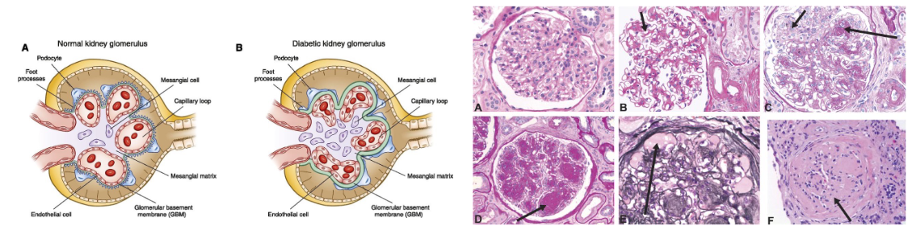

# Glomeruli Detection

## Project Outline

A correct identification and classification of glomeruli is of
paramount importance for the prognosis of the diabetic kidney disease [1]. This project aims at developing a ML pipeline able to:
1. Identify the glomeruli
2. Segment them
3. Separate different glomeruli classes in an unsupervised way. 

Since no ground truth is available in terms of glomeruli classification, we wish an unsupervised solution to see if any separability exists. We considered manifold learning methods to assess the separability of the different level of glomeruli necrotization.
 


## Requirements

All the requirements are listed in the `requirements.txt` file. You can install them using the custom script `setup_env.sh`. First, make sure the script is executable:
```bash
chmod +x setup_env.sh
```
Then, run the script:
```bash
./setup_env.sh
```

Remember to launch the script in the **root** folder of the project. For example:
```bash
cd /path/to/project
python src/segmentation/example_script.py
```

## Contributors
Here is the list of contributors to this project:
- [Massimo Francios](www.github.com/maxfra01)
- [Francesco Alzate]()
- [Samuele Carrea]()
- [Mateo Perez de Gracia Di Seri]()

## References

- [1] [**Diabetic kidney disease: challenges, progress, and possibilities**. Clinical journal of the American Society of Nephrology, 2017](https://pubmed.ncbi.nlm.nih.gov/28522654/)

- [2] [**Glomerulosclerosis identification in whole slide images usingsemantic segmentation**. Computer methods and programs in biomedicine, 2020](https://pubmed.ncbi.nlm.nih.gov/31891905/)